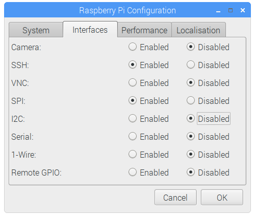

# Round-Display-HAT

Round LCD HAT is a 1.28-inch display expansion board module of 240×240 resolution, 65K RGB colours, clear and colourful displaying effect, with a joystick, designed for Raspberry Pi to expand its engagement via SPI communication by providing standard 40 pins GPIO interface. 

### Pinout :

|  Round LCD Pins |   Raspberry Pi Pins  |
|-----------------|----------------------|
| LCD DIN         |   GPIO10             |
| LCD CLK         |   GPIO11             |
| LCD DC          |   GPIO25             |
| LCD CS          |   GPIO8              |
| LCD RST         |   GPIO27             |
| LCD BL          |   GPIO18             |
| JOYSTICK UP     |   GPIO6              |
| JOYSTICK DOWN   |   GPIO13             |
| JOYSTICK LEFT   |   GPIO26             |
| JOYSTICK RIGHT  |   GPIO5              |
| JOYSTICK SELECT |   GPIO19             |

### Installation

### Enable I2C and Serial Interface

 Open a terminal and run the following commands to enable I2C and Serial：


* ``` sudo raspi-config ```

Choose Interfacing Options -> SPI -> Yes 

* You can also use GUI method to enable SPI Go to Menu > Preferences > Raspberry Pi Configuration > Interfaces , and enable SPI



## Testing

* Stack Round LCD HAT on top of Raspberry Pi GPIO Header pins.
*  Make Sure SPI is Enabled (Already mentioned above)

### Clone Repository

``` git clone https://github.com/sbcshop/Round-LCD-HAT.git ```

``` cd Round-LCD-HAT ```
Now execute demo code by running below command

``` python3 demo.py ```

This will display a running clock on the screen.

* You can also run "LcdDemo_Joystick.py" file to display image and change color of arc using attached 5 input joystick.

``` python3 LcdDemo_Joystick.py ```

